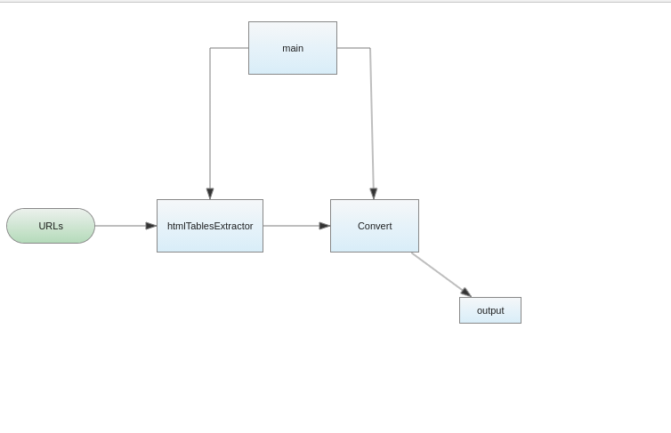

# Functional aspect

## Global architecture

This project has been implemented in procedural programming according to this schema :

## Schema Description

|   | Description | 
| --- | --- |
| main| Runs the programm by executing the htmlTablesExtractor and the converter |
| URLs| List of URLs  obtained from URIs contained in wikiurl.txt |
| htmlTablesExtractor | Method for extracting HTML tables from Wikipedia pages  |
| Converter |Convert the table obtained from the htmlTablesExtractor to a CSV file   |
| output| Folder containing csv files after conversion |

## Project operations

##### I. Retrieve URIs to form URLs  

=> Dictionary of urls: read the file ''wikiurls,txt'' and for each line, we will create a url.

|Key : uri (page name)|Value : url|
|---|---|
|Comparison_between_Esperanto_and_Ido|https://en.wikipedia.org/wiki/Comparison_between_Esperanto_and_Ido|
|Comparison_between_Esperanto_and_Interlingua|https://en.wikipedia.org/wiki/Comparison_between_Esperanto_and_Interlingua| 

##### II. Browse URLs to retrieve the table(s) (in html format)  

We use 2 libraries : 

    a- urllib  
    b- Library : beautifulsoup  
    
=> Dictionary of tables with for key: uri and for value: list of tables in the page  

|Key : uri|Value: list of tables|
|---|---|
|Comparison_between_Esperanto_and_Ido | e.g: ["\<table class="\wikitable">\</table>"\,"\<table class="\wikitable"\>\</table>\"\]|
|Comparison_between_Esperanto_and_Interlingua | e.g: ["\<table class="wikitable">\</table>"\,<table class="\wikitable\"\>\</table>\"\] |

##### III. Convert to CSV  

=> The conversion is done with pandas library
  
