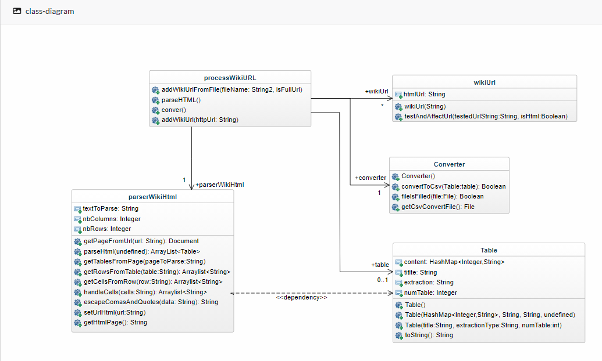

# Functional aspect

## Global architecture

## Class descriptions

| Class | Description |
|---|---|
|ProcessWikiUrl|Executes the program by generating the various Wikipedia URLs from txt files and instantiating a WikiUrl Object List.  Then, it triggers the extraction of HTML and Wiki text by calling the Parser methods.|
|WikiUrl|Contains 1 attribute to store the http url|
|ParserHTML|Contains methods for extracting HTML tables from Wikipedia pages.|
|Table|The "content" attribute of this class represents the content of a table. It contains a key (the number of the row) and a value (a String table containing the text of each cell)|
|Converter|Convert the table obtained from the ParserHTML to a CSV file|

I. List of uri: wikiurl.txt

1. Retrieve URIs to form URLs  
2. Browse URLs to retrieve the table(s) (html format)  
3. Convert to CSV format  

1.Dictionary of urls: read the file ''wikiurls,txt'' and for each line, we will create a url.

|Key : uri (page name)|Value : ‘’https://en...’’|
|---|---|
|Comparison_between_Esperanto_and_Ido|https://en.wikipedia.org/wiki/Comparison_between_Esperanto_and_Ido|
|Comparison_between_Esperanto_and_Interlingua|https://en.wikipedia.org/wiki/Comparison_between_Esperanto_and_Interlingua|

2. Browse URLs to retrieve the table(s) (html format)  
a- Library: urllib.request  
b- Library : beautifulsoup  
* Dictionary of tables with for key: uri and for value: list of tables in the page  

|Key : uri|Value: list of tables|
|---|---|
|Comparison_between_Esperanto_and_Ido | ["\<table class="\wikitable">\</table>"\,"\<table class="\wikitable"\>\</table>\"\]|
|Comparison_between_Esperanto_and_Interlingua | ["\<table class="wikitable">\</table>"\,<table class="\wikitable\"\>\</table>\"\] |

3. Convert to CSV  
  a- Library : panda

### Libraries

We will use two libraries for this project
- urllib.request will allow you to access the URL of the page.
- Beautiful Soup 4 will parse the HTML.
